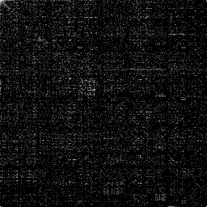

# File (to) Image Transformer

This is a tool that converts any file to an image that can be used for visualization and reverse
engineering.

## Examples

### Digraph

#### JPEG

Here the Doge is converted.

#### Ascii

Here [main.rs](src/main.rs) is converted to an image.

## Inspiration and references

- https://www.youtube.com/watch?v=AUWxl0WdiNI
- https://www.youtube.com/watch?v=4bM3Gut1hIk
